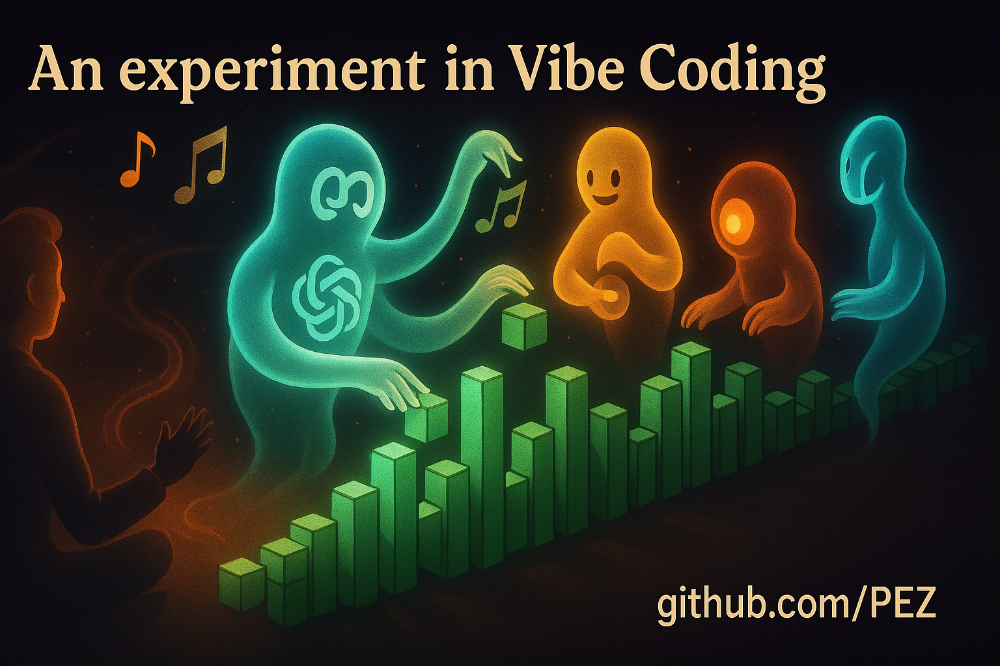

# A Vibe Coded GitHub Contributions Graph



A playful take on the GitHub contributions heatmap — turning weekly commit stats into a spatial, interactive, and musical timeline of code.

> Built by ChatGPT\
> Directed by PEZ, a human with strong vibes

**Try it out live:** [https://pez.github.io/github-contributions/](https://pez.github.io/github-contributions/)

*With occasional insights from Gemini 2.5 Pro, Grok 3, and Claude 3.5 Sonnet when we got stuck. Collaborative intelligence at work.*

---

## 🌱 Purpose

This project is primarily an exploration of **vibe coding** — the joyful resistance against overthinking code. It's about staying in flow, letting intuition lead, and shaping experiences with feeling instead of friction.

At the same time, it explores how contribution data can be experienced, not just visualized.

Instead of the classic 2D grid:

- Each day becomes a 3D block, rising with activity.
- Months are laid out like calendar pages, spaced through depth.
- Hovering plays notes, turning commits into melodies.
- You can orbit, zoom, and fly over your timeline with keyboard controls.

The aim isn't just accuracy — it's resonance. We want it to feel like something.

---

## 🧠 How It’s Made

This graph is designed in collaboration between PEZ (the director) and ChatGPT (the implementer), with thoughtful interjections from other large language models — Gemini 2.5 Pro, Grok 3, and Claude 3.5 Sonnet — whose perspectives helped unstick moments of complexity and broaden the creative flow. The process is organic, iterative, and conversational:

- PEZ guides the direction: layout, aesthetic, mood.
- ChatGPT translates the intention into working code.
- Everything is tested live in the browser via Vite.
- If it doesn't vibe, it's rewritten. Quickly.

PEZ is a "vibe coder": not buried in implementation, but steering the energy. ChatGPT is the keyboard: rendering the vision in precise, flexible structures.

---

## 🎫 Features

- 3D blocks, one per day
- Color and height reflect contribution volume
- Tooltip reveals exact date + count
- Hovering a block plays a musical note
- Sound toggle included
- Keyboard movement (WASD) lets you travel through your year
- Labels for months float alongside the data

---

## 🎵 Sound Design

Notes are simple sine waves, pitched to match activity level:

- More contributions → higher note
- Each plays once on hover, then fades
- Gentle by default, unless you're really active

---

## 🧪 Running Locally

If you're just here to see it run:

```bash
npm install
npm run dev
```

